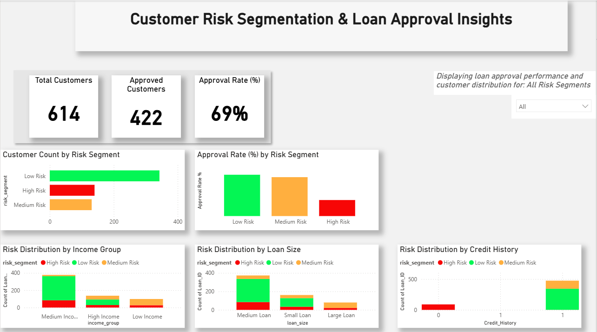

Credit Risk Analysis & Loan Approval Insights

📊 Project Overview

This project analyzes loan application data to identify key factors influencing loan approval and customer risk. The goal is to understand what drives loan decisions and segment customers based on risk levels.

🎯 Objectives
- Identify high-risk vs low-risk customers
- Analyze factors affecting loan approval
- Build a simple risk segmentation model
- Present insights through an interactive Power BI dashboard

📁 Dataset
- Source: Loan Prediction Dataset (Kaggle)
- Records: 614 loan applications
- Key Features:
	- Applicant Income
	- Loan Amount
	- Credit History
	- Loan Status (Approved / Rejected)

🛠 Tools & Technologies
- Excel → Initial data exploration
- SQL → Data analysis & aggregation
- Power BI → Dashboard & visualization

🔍 Analysis Process
1. Data Exploration (Excel)
   - Identified missing values in multiple columns
   - Performed initial pattern analysis
   - Calculated approval rates
2. Data Analysis (SQL)
   - Computed approval rates by credit history
   - Aggregated customer segments
   - Created derived datasets:
	- risk_model.csv
	- risk_summary.csv
3. Visualization (Power BI)
   - Built an interactive dashboard including:
	- Approval rate KPIs
	- Risk segmentation (Low / Medium / High)
	- Approval rate by credit history
	- Customer distribution analysis

📈 Key Insights
- Credit history is the strongest predictor of loan approval
	- ~80% approval rate for applicants with good credit
	- ~8% approval rate for applicants with poor credit
- Income has limited influence
	- Low-income applicants with good credit are often approved
	- High-income applicants without good credit may be rejected
- Loan amount shows weak correlation
	- No consistent pattern between loan size and approval

📊 Dashboard
The Power BI dashboard provides:

   - Approval rate overview
   - Risk segmentation breakdown
   - Key drivers of loan approval

📌 (See /visuals/dashboard.png)

📂 Project Structure
credit-risk-analysis/
│
├── data/
│   ├── raw/
│   │   └── train.csv
│   ├── processed/
│   │   ├── risk_model.csv
│   │   └── exploratory_analysis.xlsx
│   └── outputs/
│       └── risk_summary.csv
│
├── sql/
│   └── analysis_queries.sql
│
├── powerbi/
│   └── dashboard.pbix
│
├── visuals/
│   └── dashboard.png
│
└── README.md
📌 Conclusion

Credit history plays a dominant role in loan approval decisions and should be the primary factor in risk assessment. This project demonstrates how data analysis tools can be used to derive actionable insights for financial decision-making.
